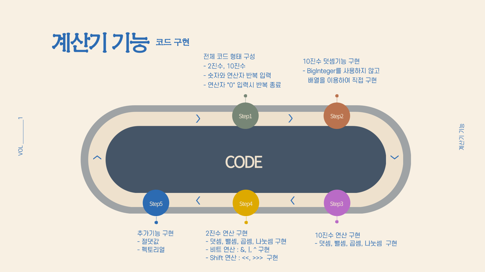

# 🎲 Programmer Calculator 🎲
It is a programmer calculator capable of binary and decimal calculations of **infinite digits**.

 

## ⚙ Requirement
For building and running the applicaion you need:
* `eclipse`
  * jdk1.8.0_361
  * JavaSE-1.8

 

## 🎮 기능
#### 정수 자료형의 볌위를 넘어가는 값 계산 가능 (`Biginteger 함수` 사용없이 직접구현)
* 2진수, 10진수 계산
* 2의 보수
* 기본 사칙연산  : `+`, `-`, `/`, `*`
* SHIFT 연산  :  `<<`, `>>>`
* 비트연산  :  AND `&`, OR `|`, XOR `^`
* 절댓값 `abs`, 펙토리얼 `ff`
* 계산 반복문 종로  :  `0`

## 🎮 Functions
#### It is possible to calculate the value beyond the crest of an integer data type (without `Biginteger function`)
* Binary calculation, Decimal calculation
* Two's complement
* Four arithmetic operations  : `+`, `-`, `/`, `*`
* SHIFT operations  :  `<<`, `>>>`
* Bit operations  :  AND `&`, OR `|`, XOR `^`
* Absolute value `abs`, Factorial `ff`
* End of calculation loop  :  `0`
  

 

## 🎞 DEMO
2진수 계산(Binary calculation)

10진수 계산(Decimal calculation)

